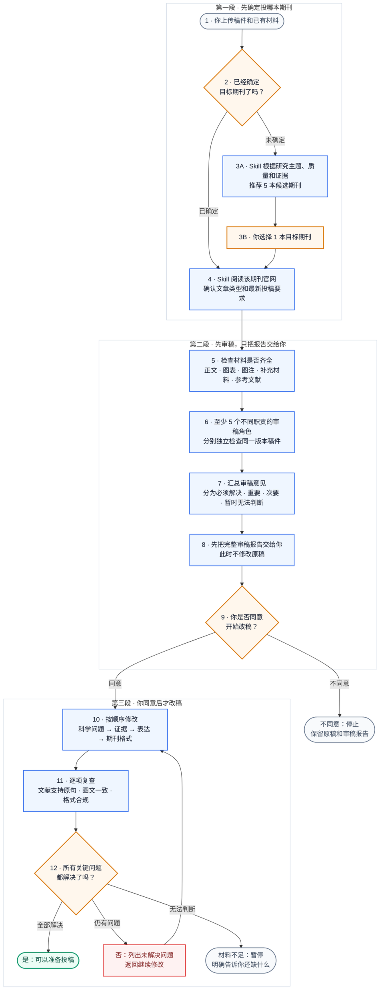

# Manuscript Review & Revision Skill

[English](README_EN.md)

一个面向科学手稿的 **期刊感知、先审后改、作者授权驱动** 的 Codex Skill。它先按目标期刊配置 5–6 个独立审稿角色，再处理科学修改、文献核查、语言和正式投稿排版。

[](https://github.com/Jameslxr/manuscript-review-revision-skill/actions/workflows/validate.yml)


[](LICENSE)

## 30 秒判断：它解决什么问题

| 常见问题 | 本 Skill 的处理方式 |
|---|---|
| 不同稿件都被套用同一套顶刊标准 | 先核实目标期刊、文章类型和投稿阶段，再校准审稿门槛 |
| AI 一上来就润色或改格式 | 原稿在独立科学审稿完成前保持只读 |
| 单一模型容易遗漏或自我强化 | 至少 5 个独立审稿角色；高档期刊或高风险研究增加第 6 席 |
| 文献真实却并不支持对应论断 | 分开检查文献真实性、格式和 Claim–Evidence 支持关系 |
| Word 输出像彩色商业报告 | 按正式 manuscript 规则检查标题、章节、正文和逐页渲染 |
| 材料不足仍给出“可投稿”结论 | 关键证据缺失时返回 `FAIL` 或 `NOT ASSESSABLE` |

## 适合用它做什么

- 投稿前独立审稿和编辑初筛风险评估；
- 目标期刊不确定时，基于主题、质量、证据和可行性推荐 Top 5；
- 按期刊档次与文章类型配置审稿角色；
- 审计研究设计、统计、可重复性、图表和 Claim–Reference 关系；
- 在作者明确授权后生成 tracked copy、clean copy 和 revision log；
- 按目标期刊当前官方要求检查 DOCX/PDF 与投稿完整性；
- 根据真实审稿意见准备可追踪的返修包。

## 典型请求

| 场景 | 可以直接这样说 |
|---|---|
| 目标期刊已知 | `使用 $manuscript-review-revision。目标期刊：Journal of Hepatology。先审稿，不修改原稿。` |
| 目标期刊未知 | `使用 $manuscript-review-revision。目标期刊不确定，请推荐 Top 5。` |
| 只审稿 | `只运行 scientific-review；综合结论后暂停。` |
| 文献专项核查 | `运行 reference-audit，逐句检查引用是否真实、格式正确且直接支持 Claim。` |
| 授权修改 | `我已审阅 05_review_verdict.md，同意进入 revise-manuscript。` |

如果调用时没有写目标期刊，Skill 的第一步只会询问：

```text
本次目标期刊是什么？如果尚未确定，请回复“不确定，请推荐期刊”。
```

## 你需要提供

- manuscript 全文或需要审查的章节；
- 目标期刊；如果不确定，可直接要求推荐；
- 文章类型和投稿阶段（如已知）；
- 图、表、图注、补充材料和参考文献；
- 已知限制，例如无法新增实验、仅做初次投稿审稿或只允许诊断；
- 返修任务还需提供 editor letter、reviewer comments 和当前修订稿。

材料不完整不会被自动补写。无法可靠判断的项目会明确标记为 `NOT ASSESSABLE`。

## 一眼看懂：从上传稿件到准备投稿

**读图方法：** 橙色框需要你选择；蓝色框由 Skill 执行；绿色表示可以进入投稿准备；灰色或红色表示暂停或继续处理。



第 6 步不是让 5 个角色重复做同一件事：他们分别检查期刊匹配、领域科学、研究设计、统计与可重复性、文献是否真正支持原句。高档期刊或复杂、高风险研究会增加第 6 个专项角色。所有角色检查同一个冻结版本，并且在提交各自初审意见前看不到其他角色的结论。

[查看完整技术架构、角色配置和返回规则](docs/ARCHITECTURE.md)

## 产出

| 阶段 | 主要产物 |
|---|---|
| 期刊校准 | `00_input_inventory.json`、`01_journal_profile.json` |
| 独立审稿 | `reviews/reviewer_01.md` 至 `reviewer_05.md` 或更高 |
| 主审综合 | `04_cross_review_matrix.tsv`、`05_review_verdict.md` |
| 文献核查 | `06_reference_audit.tsv` |
| 授权修改 | tracked manuscript、clean manuscript、`revision_log.tsv` |
| 投稿门禁 | `07_format_audit.json`、`08_release_gate.md` |

## 边界

- 未确定目标期刊，不开始完整审稿；
- 少于 5 个真实独立 Agent 任务，不声称已完成多 Agent 审稿；
- 未获得作者明确授权，不修改、不润色、不排版；
- 不虚构实验、结果、文献、期刊规则、审稿人身份或已完成修改；
- 搜索摘要、标题相关或 metadata-only 结果不能作为直接支持证据；
- `RELEASE PASS` 不预测编辑决定或期刊接收；
- 未发表稿件、患者信息和受限数据必须遵守机构与保密要求。

## 快速安装

```bash
git clone https://github.com/Jameslxr/manuscript-review-revision-skill.git
cd manuscript-review-revision-skill
python3 -m pip install -r requirements.txt
mkdir -p "$HOME/.codex/skills"
ln -s "$PWD/manuscript-review-revision" \
  "$HOME/.codex/skills/manuscript-review-revision"
```

重新载入 Codex 后：

```text
使用 $manuscript-review-revision，我上传了 manuscript。
```

如目标安装路径已存在，请先确认它是否为旧版本或已有链接，不要直接覆盖。更多调用示例见 [使用指南](docs/USAGE.md)。

## 成熟度与验证

当前成熟度为 **Beta**：工作流结构和关键 fail-closed 控制已有自动测试，并完成过合成肝癌稿件的 6-Agent 前向测试；但尚不能证明每个领域判断、期刊网页或文献语义判断在所有真实稿件上都正确。

当前自动测试覆盖：

- 未解决的期刊强制规则不能通过；
- 少于 5 个独立审稿角色不能通过；
- metadata-only 证据不能标记为直接支持；
- 蓝色或非黑色 manuscript 标题样式会失败；
- 合规的黑色标题和完整审计记录可以通过。

[查看可复现验证命令与边界](docs/VALIDATION.md)

## 文档

- [技术架构与运行契约](docs/ARCHITECTURE.md)
- [安装、调用与阶段示例](docs/USAGE.md)
- [验证范围与复现命令](docs/VALIDATION.md)
- [设计来源与归因](ATTRIBUTION.md)
- [Skill 执行入口](manuscript-review-revision/SKILL.md)

本项目参考了 [Nature Skills](https://github.com/Yuan1z0825/nature-skills) 的模块化 Skill 组织和 source-first 设计思想，但采用独立的期刊感知、多 Agent 审稿与作者授权架构。本项目与 Nature Portfolio、Springer Nature 及 Nature Skills 维护者不存在官方隶属关系。
