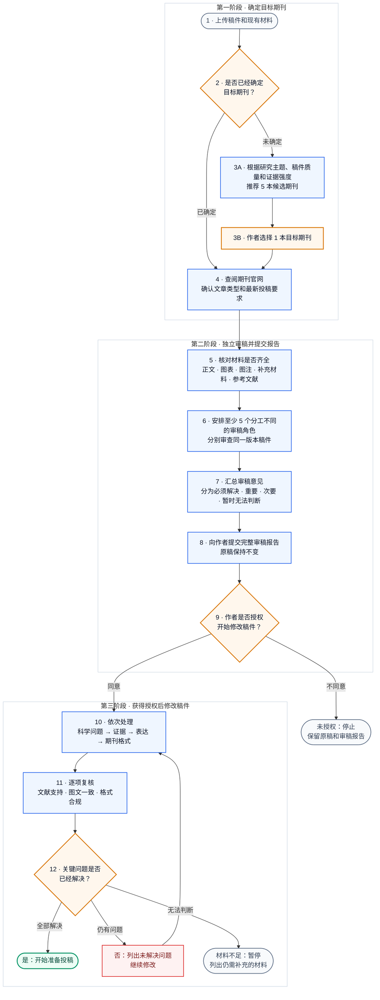

# Manuscript Review & Revision Skill

[English](README_EN.md)

这是一个用于科学论文审稿和修改的 Codex Skill。它会先确认目标期刊，并根据期刊定位安排 5–6 个相互独立的审稿角色。完成科学审查并取得作者授权后，才会进入内容修改、文献核查、语言润色和投稿格式检查。

[](https://github.com/Jameslxr/manuscript-review-revision-skill/actions/workflows/validate.yml)


[](LICENSE)

## 简要说明

| 需要处理的问题 | 处理原则 |
|---|---|
| 不同期刊的审稿标准并不相同 | 先确认目标期刊、文章类型和投稿阶段，再确定相应的审稿要求 |
| 过早润色可能掩盖尚未解决的科学问题 | 独立科学审稿完成前不修改原稿 |
| 单一审稿视角可能遗漏重要问题 | 安排至少 5 个独立审稿角色；高水平期刊或高风险研究可增加第 6 个角色 |
| 同一篇稿件多次交给通用大模型，审稿意见可能前后不一致，甚至相互矛盾 | 固定稿件版本、期刊要求和角色职责；各角色先独立审稿，再按统一规则汇总并记录分歧 |
| 文献存在并不代表它支持当前表述 | 分别核对文献真实性、引用格式及其对具体论断的支持程度 |
| 输出文件可能不符合正式投稿的排版习惯 | 检查标题、章节、正文样式，并逐页查看 DOCX 或 PDF 的实际效果 |
| 材料不足时无法判断稿件是否已具备投稿条件 | 关键证据缺失时明确判定为未通过或暂时无法评估（`FAIL` / `NOT ASSESSABLE`） |

## 主要用途

- 投稿前独立审稿和编辑初筛风险评估；
- 目标期刊尚未确定时，综合研究主题、稿件质量、证据强度和投稿可行性推荐 5 本候选期刊；
- 根据期刊定位和文章类型安排审稿角色；
- 检查研究设计、统计方法、可重复性、图表以及文献对具体表述的支持；
- 在作者明确授权后生成带修订痕迹的稿件、清洁稿和修改记录；
- 按目标期刊当前官方要求检查 DOCX/PDF 与投稿完整性；
- 根据真实审稿意见整理逐条回复和返修材料。

## 调用示例

| 使用情形 | 示例 |
|---|---|
| 目标期刊已知 | `使用 $manuscript-review-revision。目标期刊：Journal of Hepatology。先审稿，不修改原稿。` |
| 目标期刊未知 | `使用 $manuscript-review-revision。目标期刊不确定，请推荐 5 本候选期刊。` |
| 只审稿 | `只运行 scientific-review；综合结论后暂停。` |
| 文献专项核查 | `运行 reference-audit，逐句核对文献是否真实、格式是否正确，以及是否支持对应表述。` |
| 授权修改 | `我已审阅 05_review_verdict.md，同意进入 revise-manuscript。` |

如果命令中没有写明目标期刊，程序首先会询问：

```text
本次目标期刊是什么？如果尚未确定，请回复“不确定，请推荐期刊”。
```

## 需要准备的材料

- 稿件全文，或需要审查的具体章节；
- 拟投期刊；尚未确定时可直接要求推荐；
- 文章类型和投稿阶段（如果已知）；
- 图、表、图注、补充材料和参考文献；
- 已知限制，例如无法补充实验、仅进行初次投稿审稿或只需要问题诊断；
- 如为返修，还需提供编辑来信、审稿意见和当前修订稿。

程序不会自行补写缺失材料。无法可靠判断的项目会明确标记为“暂时无法评估”（`NOT ASSESSABLE`）。

## 工作流程

图中橙色表示需要作者作出选择，蓝色表示由程序执行，绿色表示可以开始准备投稿，灰色或红色表示需要暂停或继续处理。



第 6 步包含至少 5 个分工不同、相互独立的审稿角色，分别负责期刊匹配、领域科学、研究设计、统计与可重复性，以及文献对具体表述的支持。对于高水平期刊或复杂、高风险研究，可增加第 6 个专项角色。所有角色基于同一版本稿件独立形成初审意见，之后再统一汇总。这种先独立、后汇总的安排可以减少角色间的相互影响，也避免系统在尚未形成独立意见时反复改变结论。

[查看完整技术架构、角色配置和返回规则](docs/ARCHITECTURE.md)

## 输出文件

| 工作阶段 | 主要文件 |
|---|---|
| 期刊要求整理 | `00_input_inventory.json`、`01_journal_profile.json` |
| 独立审稿 | `reviews/reviewer_01.md` 至 `reviewer_05.md` 或更高 |
| 审稿意见汇总 | `04_cross_review_matrix.tsv`、`05_review_verdict.md` |
| 文献核查 | `06_reference_audit.tsv` |
| 授权后的修改 | 带修订痕迹的稿件、清洁稿、`revision_log.tsv` |
| 投稿前检查 | `07_format_audit.json`、`08_release_gate.md` |

## 使用限制

- 在目标期刊确定前，不开展完整审稿；
- 只有实际运行至少 5 个相互独立的 Agent 任务，才会报告为已完成多角色独立审稿；
- 未获得作者明确授权时，不修改、润色或重新排版原稿；
- 不虚构实验、结果、文献、期刊要求、审稿人身份或并未完成的修改；
- 搜索结果摘要、标题相似性或仅有元数据的记录，不能单独证明文献支持某项具体表述；
- `RELEASE PASS` 只表示通过当前投稿前检查，不预测编辑决定或期刊接收；
- 未发表稿件、患者信息和受限数据必须遵守机构与保密要求。

## 安装

```bash
git clone https://github.com/Jameslxr/manuscript-review-revision-skill.git
cd manuscript-review-revision-skill
python3 -m pip install -r requirements.txt
mkdir -p "$HOME/.codex/skills"
ln -s "$PWD/manuscript-review-revision" \
  "$HOME/.codex/skills/manuscript-review-revision"
```

重新载入 Codex 后，可以这样调用：

```text
使用 $manuscript-review-revision，我上传了稿件。
```

如目标安装路径已存在，请先确认它是否为旧版本或已有链接，不要直接覆盖。更多调用示例见 [使用指南](docs/USAGE.md)。

## 当前版本与验证

当前版本为 **Beta**。工作流程和关键风险控制规则已纳入自动测试，并使用一份模拟的肝细胞癌研究稿件完成过一次 6-Agent 全流程测试。这些测试只能说明工作流程能够按设计运行，不能保证每个专业判断、期刊网页解析或文献语义判断在所有真实稿件中都正确。

当前自动测试覆盖：

- 如果期刊的强制要求尚未核实，系统不会判定通过；
- 少于 5 个独立审稿角色时，系统不会判定通过；
- 仅有文献元数据时，不能标记为直接支持；
- 标题或章节使用蓝色等非黑色样式时，格式检查不通过；
- 标题为黑色且审计记录完整时，可以通过相应检查。

[查看可复现验证命令与边界](docs/VALIDATION.md)

## 相关文档

- [技术架构与运行契约](docs/ARCHITECTURE.md)
- [安装、调用与阶段示例](docs/USAGE.md)
- [验证范围与复现命令](docs/VALIDATION.md)
- [设计来源与归因](ATTRIBUTION.md)
- [Skill 执行入口](manuscript-review-revision/SKILL.md)

本项目在模块组织和优先查阅原始来源的设计上参考了 [Nature Skills](https://github.com/Yuan1z0825/nature-skills)，并独立实现了按期刊要求配置审稿角色、多人独立审稿和作者授权后修改的工作流程。本项目与 Nature Portfolio、Springer Nature 及 Nature Skills 维护者不存在官方隶属关系。
