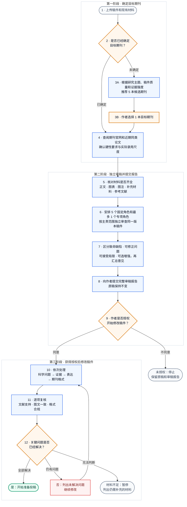

# Manuscript Review & Revision Skill

[English](README_EN.md)

这是一个用于科学论文审稿和修改的 Agent Skill，可安装在 Codex、Claude Code 及其他兼容 Agent Skills 的环境中。它会先确认目标期刊，并根据期刊定位安排 5–6 个相互独立的审稿角色。完成科学审查并取得作者授权后，才会进入内容修改、文献核查、语言润色和投稿格式检查。如果只需要 DOCX 排版而不需要科学审稿，请使用独立的 [Manuscript DOCX Formatting Skill](https://github.com/Jameslxr/manuscript-docx-formatting)。

[](https://github.com/Jameslxr/manuscript-review-revision-skill/actions/workflows/validate.yml)


[](LICENSE)

## 简要说明

| 需要处理的问题 | 处理原则 |
|---|---|
| 不同期刊的审稿标准并不相同 | 先确认目标期刊、文章类型和投稿阶段，再结合官网规则与近期同类型录用论文校准审稿尺度 |
| 过早润色可能掩盖尚未解决的科学问题 | 独立科学审稿完成前不修改原稿 |
| 单一审稿视角可能遗漏重要问题 | 安排 5 个固定独立审稿角色；高风险研究最多增加 1 个专项角色，并限制职责与输出预算 |
| 同一篇稿件多次交给通用大模型，审稿意见可能前后不一致，甚至相互矛盾 | 固定稿件、期刊要求和角色职责；记录每个 Agent 的任务收据和输出哈希，再逐条汇总共识与分歧 |
| 文献存在并不代表它支持当前表述 | 分别核对文献真实性、引用格式及其对具体论断的支持程度 |
| 输出文件可能不符合正式投稿的排版习惯 | 任何 DOCX 修改都对整份输出强制真实空段落、显式行距、连续行号和动态页码，再逐页检查 DOCX 或 PDF |
| 研究不可能在每个方面都达到理想配置 | 区分致命缺陷、投稿前可修正问题、可接受的固有局限和可选增强；只有收窄结论后仍无法成立的问题才阻断 |

## 主要用途

- 投稿前独立审稿和编辑初筛风险评估；
- 目标期刊尚未确定时，综合研究主题、稿件质量、证据强度和投稿可行性推荐 5 本候选期刊；
- 根据期刊定位和文章类型安排审稿角色；
- 检查研究设计、统计方法、可重复性、图表以及文献对具体表述的支持；
- 在作者明确授权后生成带修订痕迹的稿件、清洁稿和修改记录；
- 按目标期刊当前官方要求检查 DOCX/PDF 与投稿完整性；
- 根据真实审稿意见整理逐条回复和返修材料。

## 调用示例

| 使用情形 | 示例 |
|---|---|
| 目标期刊已知 | `使用 $manuscript-review-revision。目标期刊：Journal of Hepatology。先审稿，不修改原稿。` |
| 目标期刊未知 | `使用 $manuscript-review-revision。目标期刊不确定，请推荐 5 本候选期刊。` |
| 只审稿 | `只运行 scientific-review；综合结论后暂停。` |
| 文献专项核查 | `运行 reference-audit，逐句核对文献是否真实、格式是否正确，以及是否支持对应表述。` |
| 授权修改 | `我已审阅 05_review_verdict.md，同意进入 revise-manuscript。` |

如果命令中没有写明目标期刊，程序首先会询问：

```text
本次目标期刊是什么？如果尚未确定，请回复“不确定，请推荐期刊”。
```

## 需要准备的材料

- 稿件全文，或需要审查的具体章节；
- 拟投期刊；尚未确定时可直接要求推荐；
- 文章类型和投稿阶段（如果已知）；
- 图、表、图注、补充材料和参考文献；
- 已知限制，例如无法补充实验、仅进行初次投稿审稿或只需要问题诊断；
- 如为返修，还需提供编辑来信、审稿意见和当前修订稿。

程序不会自行补写缺失材料。无法可靠判断的项目会明确标记为“暂时无法评估”（`NOT ASSESSABLE`）。

## 工作流程

图中橙色表示需要作者作出选择，蓝色表示由程序执行，绿色表示可以开始准备投稿，灰色或红色表示需要暂停或继续处理。


```mermaid
flowchart TB
    START(["1 · 上传稿件和现有材料"])
    TARGET{"2 · 是否已经确定<br/>目标期刊？"}
    REC["3A · 根据研究主题、稿件质量和证据强度<br/>推荐 5 本候选期刊"]
    PICK["3B · 作者选择 1 本目标期刊"]
    RULES["4 · 查阅期刊官网和近期同类论文<br/>确认硬性要求与实际录用尺度"]
    CHECK["5 · 核对材料是否齐全<br/>正文 · 图表 · 图注 · 补充材料 · 参考文献"]
    REVIEW["6 · 安排 5 个固定角色和最多 1 个专项角色<br/>按主责范围独立审查同一版本稿件"]
    SUMMARY["7 · 区分致命缺陷 · 可修正问题<br/>可接受局限 · 可选增强，再汇总意见"]
    REPORT["8 · 向作者提交完整审稿报告<br/>原稿保持不变"]
    AUTH{"9 · 作者是否授权<br/>开始修改稿件？"}
    STOP(["未授权：停止<br/>保留原稿和审稿报告"])
    REVISE["10 · 依次处理<br/>科学问题 → 证据 → 表达 → 期刊格式"]
    VERIFY["11 · 逐项复核<br/>文献支持 · 图文一致 · 格式合规"]
    READY{"12 · 关键问题是否<br/>已经解决？"}
    PASS(["是：开始准备投稿"])
    RETURN["否：列出未解决问题<br/>继续修改"]
    MISSING(["材料不足：暂停<br/>列出仍需补充的材料"])

    subgraph S1["第一阶段 · 确定目标期刊"]
        direction LR
        START --> TARGET
        TARGET -- "已确定" --> RULES
        TARGET -- "未确定" --> REC --> PICK --> RULES
    end

    subgraph S2["第二阶段 · 独立审稿并提交报告"]
        direction LR
        CHECK --> REVIEW --> SUMMARY --> REPORT --> AUTH
    end

    subgraph S3["第三阶段 · 获得授权后修改稿件"]
        direction LR
        REVISE --> VERIFY --> READY
        READY -- "全部解决" --> PASS
        READY -- "仍有问题" --> RETURN --> REVISE
        READY -- "无法判断" --> MISSING
    end

    RULES --> CHECK
    AUTH -- "不同意" --> STOP
    AUTH -- "同意" --> REVISE

    classDef user fill:#FFF7ED,stroke:#D97706,stroke-width:2px,color:#0F172A;
    classDef skill fill:#EFF6FF,stroke:#2563EB,stroke-width:1.5px,color:#0F172A;
    classDef success fill:#ECFDF5,stroke:#059669,stroke-width:2px,color:#064E3B;
    classDef stop fill:#F8FAFC,stroke:#64748B,stroke-width:1.5px,color:#334155;
    classDef problem fill:#FEF2F2,stroke:#DC2626,stroke-width:1.5px,color:#7F1D1D;
    class TARGET,PICK,AUTH,READY user;
    class REC,RULES,CHECK,REVIEW,SUMMARY,REPORT,REVISE,VERIFY skill;
    class PASS success;
    class START,STOP,MISSING stop;
    class RETURN problem;
    style S1 fill:#FFFFFF,stroke:#CBD5E1,stroke-width:1px
    style S2 fill:#FFFFFF,stroke:#CBD5E1,stroke-width:1px
    style S3 fill:#FFFFFF,stroke:#CBD5E1,stroke-width:1px
```

第 6 步包含 5 个固定、相互独立的审稿角色，分别负责期刊匹配、领域科学、研究设计、统计与可重复性，以及文献对具体表述的支持。系统记录每个 Agent 的真实任务 ID、运行时间、输入与报告哈希；随后将每条问题连接到原文和证据位置，再区分共识、分歧和独有意见。高风险研究最多增加 1 个专项角色；每席最多 8 个优先问题和 1,800 个等效词单位，避免多人重复整稿审查。

[查看完整技术架构、角色配置和返回规则](docs/ARCHITECTURE.md)

## 输出文件

| 工作阶段 | 主要文件 |
|---|---|
| 期刊要求与录用尺度 | `00_input_inventory.json`、`01_journal_profile.json`、`01a_journal_format_plan.json`、`01b_acceptance_tolerance_card.json` |
| 独立审稿 | `03_review_panel_plan.json`、各 reviewer 报告、`reviews/concern_ledger.tsv` |
| 审稿意见汇总 | `04_cross_review_matrix.tsv`、`05_review_verdict.md` |
| 文献核查 | `06_reference_audit.tsv` |
| 授权后的修改 | 带修订痕迹的稿件、清洁稿、`revision_log.tsv` |
| 投稿前检查 | `07_format_audit.json`、`08_release_gate.md` |

## 使用限制

- 在目标期刊确定前，不开展完整审稿；
- Panel 固定 5 个核心席位、最多 1 个有明确触发原因的专项席位；未完成时工作流保证为 `NOT ASSESSABLE`，但不会被误写成稿件本身的科学缺陷；
- 未获得作者明确授权时，不修改、润色或重新排版原稿；
- 不虚构实验、结果、文献、期刊要求、审稿人身份或并未完成的修改；
- 搜索结果摘要、标题相似性或仅有元数据的记录，不能单独证明文献支持某项具体表述；
- 最终分别报告稿件就绪度与工作流保证；`RELEASE PASS` 只表示两者均通过，不预测编辑决定或期刊接收；
- 未发表稿件、患者信息和受限数据必须遵守机构与保密要求。

## 安装

```bash
git clone https://github.com/Jameslxr/manuscript-review-revision-skill.git
cd manuscript-review-revision-skill
python3 -m pip install -r requirements.txt
```

个人级安装（按使用的平台选择）：

```bash
# Codex
mkdir -p "$HOME/.codex/skills"
ln -s "$PWD/manuscript-review-revision" "$HOME/.codex/skills/manuscript-review-revision"
# Claude Code
mkdir -p "$HOME/.claude/skills"
ln -s "$PWD/manuscript-review-revision" "$HOME/.claude/skills/manuscript-review-revision"
```

调用方式：

```text
Codex：使用 $manuscript-review-revision，我上传了稿件。
Claude Code：/manuscript-review-revision 我上传了稿件。
```

不要只复制 `SKILL.md`，因为运行还需要 `references/` 和 `scripts/`。Claude Code 的项目级安装、其他宿主要求和完整调用示例见 [使用指南](docs/USAGE.md)。

## 当前版本与验证

当前版本为 **Beta**。1.7.0 新增独立的可编辑投稿包排版通道：cover letter、response letter 和其他 submission text 现在使用角色识别、全文统一行距/字号、真实空段落、连续行号/页码及 fail-closed package release gate；同时加入“期刊官方措辞优先、实际 AI 用途为准”的 AI 使用声明规则。1.6.1 的 manuscript 语义纵向节奏门及 1.5.0 的录用尺度校准、四类问题判定和分层引用审计保持不变；既有复测曾保持 18/18 个预埋问题检出。这些结果只适用于相应测试，不代表对所有稿件或模型的普遍性能保证。完整方法和边界见 `benchmarks/` 与 [验证文档](docs/VALIDATION.md)。

当前自动测试覆盖：

- 如果期刊强制要求尚未核实，或录用尺度卡不足 5 篇且未说明替代原因，系统不会判定通过；
- 少于 5 个独立 Agent、第 7 个 reviewer、任务 ID 重复、职责轴错配、输入/报告哈希不一致或单席超出预算时，Panel 不会通过；作者版结论超过 900 个等效词单位或包含多个姿态时也不会通过；
- 单个 reviewer 不能把自己的意见标记为共识；每个问题必须记录四类判定、处理方式和收窄结论后的可辩护性，且可接受局限或可选增强不能被标成 `BLOCKING`；
- 仅有文献元数据时不能标记为直接支持；核心/支持性 Claim 必须完整核查，普通背景 Claim 的未完成抽查只产生提示；
- 标题或章节使用蓝色等非黑色样式时，格式检查不通过；
- 手工 paragraph spacing、缺少真实空段落、首页居中/混合对齐、作者/单位字号偏小、角色行距混用、Keywords 未加粗、section/CRediT 空行错误、行号或动态页码不完整时，综合格式发布门不通过；
- 合规的黑色标题和完整审计记录可以通过相应检查。

[查看可复现验证命令与边界](docs/VALIDATION.md)

## 相关文档

- [技术架构与运行契约](docs/ARCHITECTURE.md)
- [安装、调用与阶段示例](docs/USAGE.md)
- [验证范围与复现命令](docs/VALIDATION.md)
- [设计来源与归因](ATTRIBUTION.md)
- [Skill 执行入口](manuscript-review-revision/SKILL.md)
本项目在模块组织和优先查阅原始来源的设计上参考了 [Nature Skills](https://github.com/Yuan1z0825/nature-skills)，并独立实现了按期刊要求配置审稿角色、多人独立审稿和作者授权后修改的工作流程。本项目与 Nature Portfolio、Springer Nature 及 Nature Skills 维护者不存在官方隶属关系。
