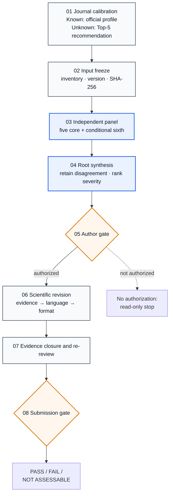

# Manuscript Review & Revision Skill

[中文说明](README.md)

A **journal-aware, review-first, author-gated** Codex skill for scientific manuscripts. It calibrates an independent 5–6-agent review panel to the target journal before allowing scientific revision, reference verification, language work, or formal manuscript formatting.

[](https://github.com/Jameslxr/manuscript-review-revision-skill/actions/workflows/validate.yml)


[](LICENSE)

## What It Solves

| Common failure | How this skill responds |
|---|---|
| Every manuscript is judged against the same flagship-journal standard | Verifies the target journal, article type, and submission stage before calibrating review criteria |
| AI starts polishing before resolving scientific problems | Keeps the manuscript read-only until independent review is complete |
| One model misses issues or reinforces its own view | Uses at least five independent review roles and adds a sixth for high-tier or high-risk work |
| A real paper is cited for a claim it does not support | Separates reference reality, formatting, and claim-level evidence support |
| Word output looks like a colored business report | Audits headings, sections, body styles, and rendered manuscript pages |
| Incomplete evidence still receives a ready-to-submit label | Returns `FAIL` or `NOT ASSESSABLE` when critical evidence is missing |

## What To Use It For

- independent pre-submission review and editorial-screening risk assessment;
- verified Top-5 journal recommendation when the target is uncertain;
- review-panel calibration by journal tier and manuscript type;
- study-design, statistics, reproducibility, figure, and claim-reference auditing;
- tracked, clean, and logged revisions after explicit author authorization;
- current official-journal DOCX/PDF and submission-package checks;
- traceable revision packages based on real reviewer comments.

## Typical Requests

| Scenario | Example |
|---|---|
| Target journal known | `Use $manuscript-review-revision. Target: Journal of Hepatology. Review first; do not revise.` |
| Target journal unknown | `Use $manuscript-review-revision. The target is uncertain; recommend a verified Top 5.` |
| Review only | `Run scientific-review only and pause after synthesis.` |
| Reference audit | `Run reference-audit and verify reality, format, and direct claim support.` |
| Authorize revision | `I reviewed 05_review_verdict.md and authorize revise-manuscript.` |

If no target journal is supplied, the first response asks only:

```text
What is the target journal? If it is not yet decided, reply: “Uncertain; recommend journals.”
```

## What You Need To Provide

- the full manuscript or sections to review;
- the target journal, or permission to recommend one;
- article type and submission stage when known;
- figures, tables, legends, supplements, and references;
- constraints such as no new experiments, diagnosis only, or review only;
- for revision responses: the editor letter, reviewer comments, and current manuscript.

Missing material is not silently invented. Items that cannot be judged reliably are marked `NOT ASSESSABLE`.

## Workflow



The panel router uses **journal tier × manuscript type × study risk**. Five core roles cover journal/editorial fit, domain science, study design, statistics/reproducibility, and claim–evidence–reference integrity. A sixth role is conditionally added for adversarial review, figure/narrative integrity, or reporting standards.

[Read the full technical architecture](docs/ARCHITECTURE.md)

## Outputs

| Phase | Main artifacts |
|---|---|
| Journal calibration | `00_input_inventory.json`, `01_journal_profile.json` |
| Independent review | `reviews/reviewer_01.md` through `reviewer_05.md` or higher |
| Synthesis | `04_cross_review_matrix.tsv`, `05_review_verdict.md` |
| Reference audit | `06_reference_audit.tsv` |
| Authorized revision | tracked manuscript, clean manuscript, `revision_log.tsv` |
| Submission gate | `07_format_audit.json`, `08_release_gate.md` |

## Boundaries

- Full review does not begin until the target journal is fixed.
- Fewer than five actual independent agent tasks cannot be reported as a completed multi-agent review.
- No revision, polishing, or formatting occurs without explicit author authorization.
- The skill does not invent experiments, results, citations, journal rules, reviewer identities, or completed changes.
- Search snippets, title similarity, and metadata-only results do not establish direct scientific support.
- `RELEASE PASS` does not predict editorial decisions or acceptance.
- Unpublished manuscripts, patient information, and restricted data remain subject to institutional and confidentiality rules.

## Quick Install

```bash
git clone https://github.com/Jameslxr/manuscript-review-revision-skill.git
cd manuscript-review-revision-skill
python3 -m pip install -r requirements.txt
mkdir -p "$HOME/.codex/skills"
ln -s "$PWD/manuscript-review-revision" \
  "$HOME/.codex/skills/manuscript-review-revision"
```

Reload Codex, then invoke:

```text
Use $manuscript-review-revision. I uploaded a manuscript.
```

Do not overwrite an existing install path without checking whether it is an older copy or symlink. More examples are in the [usage guide](docs/USAGE.md).

## Maturity And Validation

Maturity is currently **Beta**. The workflow structure and selected fail-closed controls have automated tests, and the full panel path has been exercised with a synthetic hepatocellular-carcinoma manuscript. This does not prove that every domain judgment, journal page, or citation-support decision will be correct for every real manuscript.

Current automated coverage includes:

- unresolved mandatory journal rules cannot pass;
- panels with fewer than five independent reviewer roles cannot pass;
- metadata-only evidence cannot be labeled direct support;
- blue or otherwise non-black manuscript headings fail;
- complete audit records and compliant black headings can pass.

[Read the reproducible validation scope](docs/VALIDATION.md)

## Documentation

- [Technical architecture and operating contract](docs/ARCHITECTURE.md)
- [Installation, invocation, and phase examples](docs/USAGE.md)
- [Validation scope and reproducible checks](docs/VALIDATION.md)
- [Design basis and attribution](ATTRIBUTION.md)
- [Skill execution entrypoint](manuscript-review-revision/SKILL.md)

This project was informed by the modular organization and source-first design of [Nature Skills](https://github.com/Yuan1z0825/nature-skills), while independently implementing journal-aware multi-agent review and author-gated revision. It is not affiliated with Nature Portfolio, Springer Nature, or the Nature Skills maintainers.
