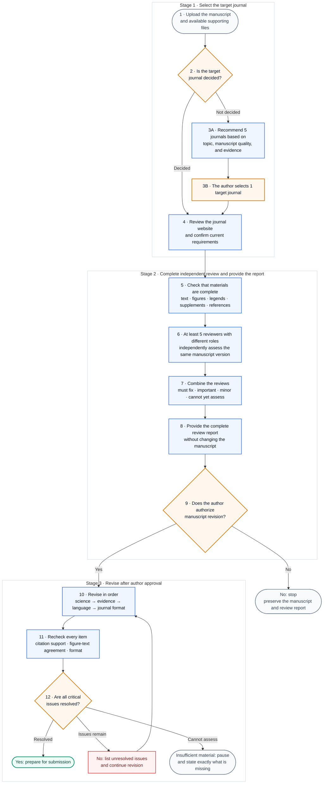

# Manuscript Review & Revision Skill

[中文说明](README.md)

This Codex skill supports scientific manuscript review and revision. It first confirms the target journal and assigns 5–6 independent reviewer roles suited to that journal. Scientific revision, reference checking, language editing, and submission formatting begin only after the review is complete and the author explicitly approves revision.

[](https://github.com/Jameslxr/manuscript-review-revision-skill/actions/workflows/validate.yml)


[](LICENSE)

## Summary

| Review consideration | Approach |
|---|---|
| Review criteria vary across journals | Confirms the target journal, article type, and submission stage before setting the review criteria |
| Editing too early can obscure unresolved scientific issues | Keeps the manuscript unchanged until the independent scientific review is complete |
| A single review perspective can miss important problems | Uses at least five independent reviewer roles and may add a sixth for high-tier journals or high-risk studies |
| Repeated reviews of the same manuscript by a general-purpose model may be inconsistent or internally contradictory | Fixes the manuscript version, journal requirements, and reviewer responsibilities; reviewers work independently before disagreements are recorded and synthesized under common rules |
| An existing reference may not support the statement where it is cited | Checks reference validity, citation format, and support for the specific statement separately |
| Generated files may not follow standard manuscript conventions | Checks headings, sections, body styles, and the rendered DOCX or PDF pages |
| Submission readiness cannot be judged when key evidence is missing | Reports the manuscript as failed or not assessable (`FAIL` / `NOT ASSESSABLE`) |

## Main Uses

- independent pre-submission review and editorial-screening risk assessment;
- recommendation of five suitable journals when the target has not been selected;
- reviewer-role selection based on journal level and manuscript type;
- review of study design, statistics, reproducibility, figures, and citation support;
- tracked and clean manuscripts with a revision log after explicit author authorization;
- DOCX/PDF and submission-package checks against current official journal requirements;
- structured response and revision materials based on actual reviewer comments.

## Invocation Examples

| Scenario | Example |
|---|---|
| Target journal known | `Use $manuscript-review-revision. Target: Journal of Hepatology. Review first; do not revise.` |
| Target journal unknown | `Use $manuscript-review-revision. The target is uncertain; recommend five candidate journals.` |
| Review only | `Run scientific-review only and pause after synthesis.` |
| Reference audit | `Run reference-audit and check whether each reference is valid, correctly formatted, and supports the cited statement.` |
| Authorize revision | `I reviewed 05_review_verdict.md and authorize revise-manuscript.` |

If no target journal is supplied, the first response asks only:

```text
What is the target journal? If it is not yet decided, reply: “Uncertain; recommend journals.”
```

## Required Materials

- the full manuscript or sections to review;
- the target journal, or permission to recommend one;
- article type and submission stage when known;
- figures, tables, legends, supplements, and references;
- constraints such as no new experiments, diagnosis only, or review only;
- for revision responses: the editor letter, reviewer comments, and current manuscript.

The skill does not invent missing material. Items that cannot be judged reliably are marked `NOT ASSESSABLE`.

## Workflow

Orange boxes require a decision from the author. Blue boxes show work performed by the skill. Green means that submission preparation can begin; gray or red means that the process must pause or continue.



Step 6 assigns at least five independent reviewer roles with separate responsibilities: journal fit, domain science, study design, statistics and reproducibility, and citation support. A sixth specialist may be added for a high-tier journal or a complex, high-risk study. Each reviewer forms an initial assessment from the same manuscript version before the reviews are combined. This independent-first design reduces cross-role influence and prevents the combined review from changing direction before each role has recorded its own assessment.

[Read the full technical architecture](docs/ARCHITECTURE.md)

## Output Files

| Stage | Main files |
|---|---|
| Journal requirements | `00_input_inventory.json`, `01_journal_profile.json` |
| Independent review | `reviews/reviewer_01.md` through `reviewer_05.md` or higher |
| Review synthesis | `04_cross_review_matrix.tsv`, `05_review_verdict.md` |
| Reference audit | `06_reference_audit.tsv` |
| Authorized revision | tracked manuscript, clean manuscript, `revision_log.tsv` |
| Pre-submission check | `07_format_audit.json`, `08_release_gate.md` |

## Limitations

- Full review does not begin until the target journal is fixed.
- Fewer than five actual independent agent tasks cannot be reported as a completed multi-agent review.
- No revision, polishing, or formatting occurs without explicit author authorization.
- The skill does not invent experiments, results, citations, journal rules, reviewer identities, or completed changes.
- Search snippets, title similarity, and metadata-only results do not establish direct scientific support.
- `RELEASE PASS` does not predict editorial decisions or acceptance.
- Unpublished manuscripts, patient information, and restricted data remain subject to institutional and confidentiality rules.

## Installation

```bash
git clone https://github.com/Jameslxr/manuscript-review-revision-skill.git
cd manuscript-review-revision-skill
python3 -m pip install -r requirements.txt
mkdir -p "$HOME/.codex/skills"
ln -s "$PWD/manuscript-review-revision" \
  "$HOME/.codex/skills/manuscript-review-revision"
```

Reload Codex, then invoke:

```text
Use $manuscript-review-revision. I uploaded a manuscript.
```

Do not overwrite an existing install path without checking whether it is an older copy or symlink. More examples are in the [usage guide](docs/USAGE.md).

## Current Status And Validation

The current release is **Beta**. The workflow and its main risk controls are covered by automated tests, and the complete 6-agent process has been exercised with a simulated hepatocellular-carcinoma manuscript. These tests show that the workflow operates as designed; they do not guarantee that every domain judgment, journal-page interpretation, or citation-support decision will be correct for every manuscript.

Current automated coverage includes:

- unresolved mandatory journal rules cannot pass;
- panels with fewer than five independent reviewer roles cannot pass;
- metadata-only evidence cannot be labeled direct support;
- blue or otherwise non-black manuscript headings fail;
- complete audit records and compliant black headings can pass.

[Read the reproducible validation scope](docs/VALIDATION.md)

## Documentation

- [Technical architecture and operating contract](docs/ARCHITECTURE.md)
- [Installation, invocation, and phase examples](docs/USAGE.md)
- [Validation scope and reproducible checks](docs/VALIDATION.md)
- [Design basis and attribution](ATTRIBUTION.md)
- [Skill execution entrypoint](manuscript-review-revision/SKILL.md)

This project draws on the modular organization and preference for primary sources used in [Nature Skills](https://github.com/Yuan1z0825/nature-skills). Its journal-specific reviewer selection, independent multi-agent review, and author-approved revision process were implemented separately. The project is not affiliated with Nature Portfolio, Springer Nature, or the Nature Skills maintainers.
