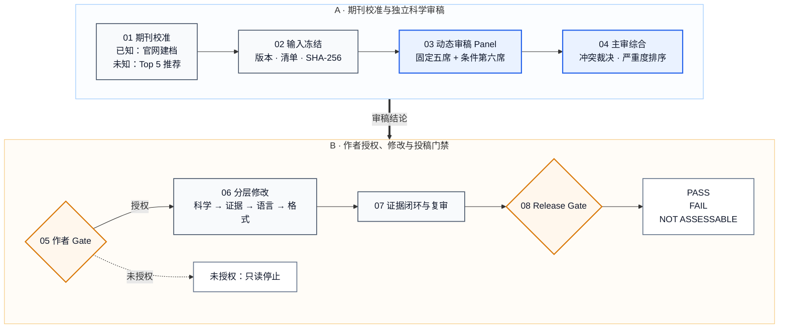
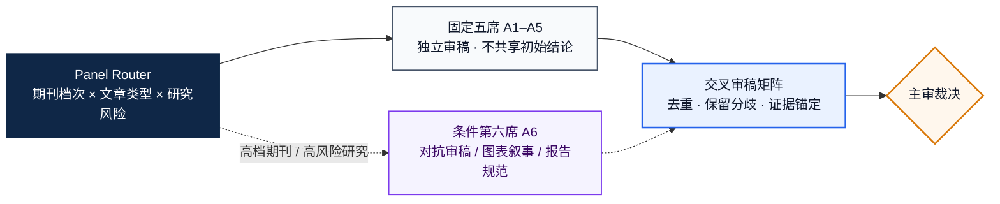

# 技术架构与运行契约

[返回中文首页](../README.md) · [English README](../README_EN.md)

本文档说明 `manuscript-review-revision` 的期刊校准、多 Agent 独立审稿、作者授权、修改闭环、投稿门禁和跨平台能力映射。核心规则与宿主无关，可在 Codex、Claude Code 及其他兼容 Agent Skills 的环境中运行；首次使用请从项目首页开始。

## 专业工作流架构

### 1. 受控稿件生命周期

主图只保留系统边界和不可绕过的 Gate。阶段编号与实际输出文件一一对应；具体角色、工具和检查项由后文配置表定义。



三条返回规则不画成长距离交叉线，以保持架构图可读：

- **R1 · 更换目标期刊：** 返回 `01 期刊校准`，重新抓取并锁定期刊规则。
- **R2 · 实质性内容变更：** 只要 claim、方法、统计、图表或参考文献发生实质变化，返回 `03 多 Agent 独立科学审稿`。
- **R3 · 投稿门禁失败：** 返回 `06 分层修改与复审`；问题关闭前不得标记为可投稿。

### 2. 动态多 Agent 审稿引擎

审稿不是由一个通用提示词完成。路由器按目标期刊档次、文章类型和研究风险配置审稿席位；各 Agent 对同一冻结稿件独立输出，之后才允许主审合并。



关键状态均有机器可检查的中间产物：`01_journal_profile.json`、`03_review_panel_plan.json`、`05_review_verdict.md`、`06_reference_audit.tsv` 和 `08_release_gate.md`。

## 安装与宿主兼容性

将仓库克隆到本地：

```bash
git clone https://github.com/Jameslxr/manuscript-review-revision-skill.git
cd manuscript-review-revision-skill
```

推荐使用符号链接安装，这样仓库更新后 Skill 会同步更新。根据宿主选择对应目录：

```bash
# Codex
mkdir -p "$HOME/.codex/skills"
ln -s "$PWD/manuscript-review-revision" \
  "$HOME/.codex/skills/manuscript-review-revision"

# Claude Code
mkdir -p "$HOME/.claude/skills"
ln -s "$PWD/manuscript-review-revision" \
  "$HOME/.claude/skills/manuscript-review-revision"
```

调用：

```text
Codex：使用 $manuscript-review-revision，我上传了稿件。
Claude Code：/manuscript-review-revision 我上传了稿件。
```

### 运行条件

- 支持完整 Agent Skill 目录及附带文件的宿主；
- 可访问期刊官网、PubMed、Crossref 或其他权威学术来源；
- 如需完成真正的多 Agent 审稿，宿主必须支持至少 5 个具有独立上下文的 Agent 任务；
- Python 3.10 或更高版本；
- DOCX 样式审计和自动测试需要 `python-docx`：

```bash
python3 -m pip install -r requirements.txt
```

平台适配的完整要求见
[`platform-compatibility.md`](../manuscript-review-revision/references/platform-compatibility.md)。

## 1. 为什么需要这个 Skill

常规 AI 改稿容易出现五类问题：

- 在科学问题尚未解决时直接润色语言；
- 不论目标期刊如何，都机械使用同一套“顶刊标准”；
- 同一稿件重复运行时意见不稳定，或不同角色在同一上下文中相互影响；
- 只核查文献是否存在，却不判断文献是否真正支持对应 Claim；
- 生成带有蓝色标题、彩色 section、卡片和横幅的报告式 DOCX，而不是正式投稿 manuscript。

本 Skill 将审稿、修改、文献核查、语言润色和排版拆分为独立阶段，并在关键阶段设置不可跳过的 Gate。

## 2. 核心原则

工作顺序固定为：

```text
目标期刊
→ 期刊档案
→ 冻结原稿
→ 独立多-Agent审稿
→ 综合结论
→ 作者授权
→ 科学修改
→ 文献与图表闭环
→ 语言润色
→ 期刊排版
→ 投稿前Release Gate
```

三条规则不可绕过：

1. 未确定目标期刊，不开始正式审稿。
2. 至少 5 个独立审稿 Agents 未完成前，不开始修改。
3. 未获得作者明确授权，不修改、不润色、不排版。

此外，Skill 不会把期刊影响力、影响因子或品牌名称当成科学质量本身。期刊档次只用于校准编辑优先级和证据深度，不用于放松研究有效性底线。

## 3. 根据期刊档次动态配置审稿 Agents

期刊档次不会改变科学有效性、伦理、文献真实性或可重复性的底线。它改变的是期刊对研究影响范围、创新幅度、验证深度、机制完整性和临床或技术后果的预期。

| 期刊编辑档次 | 默认 Panel | 主要审稿门槛 | 第 6 个 Agent |
|---|---:|---|---|
| Broad flagship | 6 | 跨领域重要性、重大概念推进、因果链完整、多层验证、非专业读者可理解性 | 对抗性审查或图表叙事审查，默认加入 |
| Top specialty | 5–6 | 领域级推进、严格设计、独立验证、机制或临床后果 | 当核心 Claim 依赖外部验证、因果链或临床效用时加入 |
| Strong specialty | 5 | 清晰的新贡献、可靠方法、充分验证、领域价值、克制的 Claim | 研究复杂或图表密集时加入 |
| Soundness-focused | 5 | 技术有效性、透明度、可重复性、伦理合规、结论不超过证据 | 通常不强制；出现高风险方法学问题时加入 |

因此，较低档次的专业期刊不会因为缺少“旗舰期刊级广泛影响”而被错误否定；但任何期刊都不能降低以下底线：

- 研究设计有效；
- 统计和计算方法合理；
- 文献真实且准确支持对应 Claim；
- 伦理、数据和报告要求合规；
- 结论不超过现有证据；
- 结果能够被审查和复现。

## 4. 默认审稿角色

每次审稿至少包含以下 5 个相互独立的功能角色：

| Agent | 审稿职责 |
|---|---|
| `journal-priority` | 期刊范围、文章类型、贡献门槛、目标读者和编辑初筛风险 |
| `domain-science` | 领域科学性、生物学或技术解释、创新性及与既往研究的关系 |
| `study-design` | 队列、实验、组学、AI、系统综述或其他研究设计的有效性 |
| `statistics-reproducibility` | 样本量、统计检验、多重比较、数据泄漏、稳健性和可重复性 |
| `claim-evidence-reference` | Claim 上限、证据闭环、参考文献、相反证据和局限性 |

高档期刊、复杂研究或图表密集型稿件增加：

| 可选 Agent | 审稿职责 |
|---|---|
| `figure-narrative-reporting` | 正文–图表–图注–数据闭环、文章架构和报告规范 |
| `adversarial-review` | 主动寻找能够推翻核心结论、阻止投稿或要求转投的关键缺陷 |

这些是功能性审稿角色，不会虚构真实审稿人的姓名、单位、资历或编辑部内部信息。

## 5. 根据文章类型替换专业角色

通用的 `study-design` Agent 会根据 manuscript 类型替换为更合适的专业审查视角：

| Manuscript 类型 | 专业审查重点 |
|---|---|
| 临床队列或试验 | 终点、混杂因素、偏倚、样本代表性和可推广性 |
| Biomarker 或预测模型 | TRIPOD/REMARK、数据泄漏、校准、外部验证和临床效用 |
| Wet-lab mechanism | 扰动逻辑、对照、因果性、rescue 和正交验证 |
| Bulk、single-cell 或 spatial omics | 预处理、batch effect、统计单位、注释和独立验证 |
| Systematic/scoping review | 检索覆盖、筛选、提取、proof distance 和综合偏倚 |
| Meta-analysis | 异质性、risk of bias、敏感性分析和发表偏倚 |
| AI 或计算方法 | 数据切分、泄漏、baseline、ablation、校准、外部测试和复现 |

## 6. 独立性和综合规则

所有 Agents 必须：

- 使用完全相同的冻结 manuscript 和期刊档案；
- 使用相同的文件 SHA-256；
- 在提交报告前看不到其他 Agent 的结论；
- 提供可定位到正文、图表、表格或补充材料的证据锚点；
- 明确区分 `BLOCKING`、`MAJOR`、`MINOR` 和 `NOT ASSESSABLE`；
- 不虚构实验、结果、引文、行号或已经完成的修改。

Root Agent 只负责最终综合，不计入 5 个审稿 Agents。综合过程不是简单多数投票；一个证据充分的阻断问题可以决定整体结论。

审稿阶段只允许返回以下一种姿态：

- `PROCEED_TO_REVISION`
- `MAJOR_SCIENTIFIC_REWORK_REQUIRED`
- `RETARGET_RECOMMENDED`
- `NOT_ASSESSABLE`

随后流程强制暂停，等待作者决定是否授权修改。

## 7. 能力和工具路由

| 阶段 | 主要能力 |
|---|---|
| 期刊推荐与规则核实 | 宿主提供的 Web、浏览器、学术数据库或 MCP 能力 |
| DOCX/PDF 读取与视觉检查 | 宿主提供的文件读取、转换、渲染和页面检查能力 |
| 独立审稿 | 非 fork 的独立上下文子 Agent；至少 5 个真实任务 |
| 期刊档案验证 | `<SKILL_ROOT>/scripts/validate_journal_profile.py` |
| Agent Panel 验证 | `<SKILL_ROOT>/scripts/validate_review_panel.py` |
| 文献支持验证 | Web 或出版社全文，加 `validate_reference_audit.py` |
| 图表闭环与重制 | 宿主已安装的科学作图 Skill、脚本或 MCP 工具 |
| DOCX 排版检查 | 渲染能力加 `audit_docx_manuscript_style.py` |
| 最终独立检查 | 宿主可用的独立 release-gate 能力 |

Codex 可以使用 collaboration/subagent delegation 以及已安装的 document、
PDF、figure 或 Nature Skills。Claude Code 应使用非 fork 的 `Agent` 子 Agent，
并调用本机可用的读取、转换、浏览器或 MCP 工具。工具名称不构成要求；行为、
证据和停止条件才是运行契约。

缺少关键能力时，Skill 必须返回 `NOT ASSESSABLE`，不能把单 Agent 模拟成
已经完成的独立多 Agent 审稿。Nature Skills 只在用户明确要求且当前宿主已经
安装时调用。

## 8. 文献和 Claim 审计

文献检查被拆分为三个独立问题：

1. **文献是否真实存在？**
   核对 DOI、PMID、题目、作者、期刊、年份和撤稿或 Expression of Concern 状态。

2. **格式是否符合目标期刊？**
   检查编号或 author–date 格式、作者截断、期刊缩写、重复文献和正文–文献表闭环。

3. **文献是否真正支持这句话？**
   将复合句拆分为 atomic claims，逐条判断证据是否直接、部分、间接、矛盾或无法评估。

一篇真实文献仍然可能是错误引用。标题相关、搜索摘要或 metadata-only 结果不能被当作直接证据。

## 9. 正式 manuscript 排版

排版阶段以目标期刊当前官方模板和投稿阶段要求为准。默认要求：

- 标题、section、subsection 和正文使用黑色；
- 不使用蓝色 Word 主题标题；
- 不使用报告式封面、卡片、横幅、图标、callout 或装饰线；
- 审稿表格和状态标签不得进入 clean manuscript；
- DOCX 必须经过机械样式检查和逐页渲染检查。

## 10. Fail-Closed Release Gate

最终状态只能是：

- `RELEASE PASS`
- `RELEASE FAIL`
- `RELEASE NOT ASSESSABLE`

任何关键材料缺失、期刊规则无法核实、文献支持未关闭、图表与正文冲突或少于 5 个独立审稿 Agents，都会阻止 `RELEASE PASS`。

该状态只表示稿件是否通过当前证据支持的投稿前检查，不预测编辑或期刊是否接收。

## 11. 调用方式

最简单的调用：

```text
使用 $manuscript-review-revision，我上传了 manuscript。
```

如果没有提供目标期刊，Skill 会先询问：

```text
本次目标期刊是什么？如果尚未确定，请回复“不确定，请推荐期刊”。
```

已知目标期刊时：

```text
使用 $manuscript-review-revision。
目标期刊：Journal of Hepatology
文章类型：Original Article
阶段：Initial submission
先审稿，不修改原稿。
```

目标期刊不确定时：

```text
使用 $manuscript-review-revision。
目标期刊不确定，请根据稿件主题、创新性、研究质量和证据强度推荐 Top 5。
```

只做审稿、不改稿时：

```text
使用 $manuscript-review-revision。
目标期刊：Journal of Hepatology
阶段：Initial submission
只运行 scientific-review。保持 manuscript 只读，完成综合结论后暂停。
```

作者审阅综合结论后，可以明确授权进入修改：

```text
我已审阅 05_review_verdict.md，同意进入 revise-manuscript。
请保留原稿，并分别输出 tracked copy、clean copy 和 revision_log.tsv。
```

“继续”“帮我看看”或上传新文件不自动视为修改授权。

## 12. 项目结构

```text
.
├── README.md
├── README_EN.md
├── ATTRIBUTION.md
├── LICENSE
├── requirements.txt
├── docs/
│   ├── ARCHITECTURE.md
│   ├── USAGE.md
│   └── VALIDATION.md
└── manuscript-review-revision/
    ├── SKILL.md
    ├── agents/
    │   └── openai.yaml
    ├── references/
    │   ├── journal-discovery-and-profile.md
    │   ├── journal-tier-rubrics.md
    │   ├── multi-agent-review.md
    │   ├── reference-integrity.md
    │   ├── revision-and-response.md
    │   ├── manuscript-formatting.md
    │   └── release-gates.md
    ├── scripts/
    │   ├── validate_journal_profile.py
    │   ├── validate_review_panel.py
    │   ├── validate_reference_audit.py
    │   ├── validate_release_docs.py
    │   └── audit_docx_manuscript_style.py
    └── tests/
        └── test_validators.py
```

## 13. 当前验证状态

- Skill 结构验证通过；
- 6 项代表性自动测试通过；
- DOCX 蓝色标题和装饰样式检查通过正反例测试；
- Claim–Reference 检查能够阻止 metadata-only 证据被标记为直接支持；
- 已使用肝癌模拟 manuscript 完成 6-Agent 前向测试；
- 前向测试在审稿结论后正确暂停，没有提前修改原稿。

复现命令、覆盖范围和边界见 [VALIDATION.md](VALIDATION.md)。

## 14. 数据、隐私与使用边界

- 未发表稿件、审稿意见、患者信息和受限数据不应提交到本仓库；
- 运行产物应保存在独立工作目录，避免与 Skill 源码混合；
- 在访问外部服务前，应确认稿件保密要求、机构政策和数据使用权限；
- 本 Skill 提供结构化审查和验证流程，不替代作者责任、统计咨询、伦理审查、法律意见或期刊编辑判断；
- `RELEASE PASS` 只表示通过当前材料可支持的投稿前检查，不代表或预测期刊接收。

## 15. 贡献与复用

欢迎在独立分支中补充新的文章类型 rubric、期刊规则解析器或验证测试。任何改动都不应削弱以下硬门槛：

- 先确定目标期刊；
- 先独立审稿、后修改；
- 至少 5 个真实独立审稿 Agents；
- Claim–Evidence–Reference 逐项闭环；
- 关键材料缺失时 fail closed。

**核心定位：** 这不是一个“自动美化论文”的工具，而是一套按目标期刊校准、先独立审稿、再经作者授权修改，并对文献、图表、排版和投稿完整性执行 Fail-Closed 检查的科研论文工作流。
